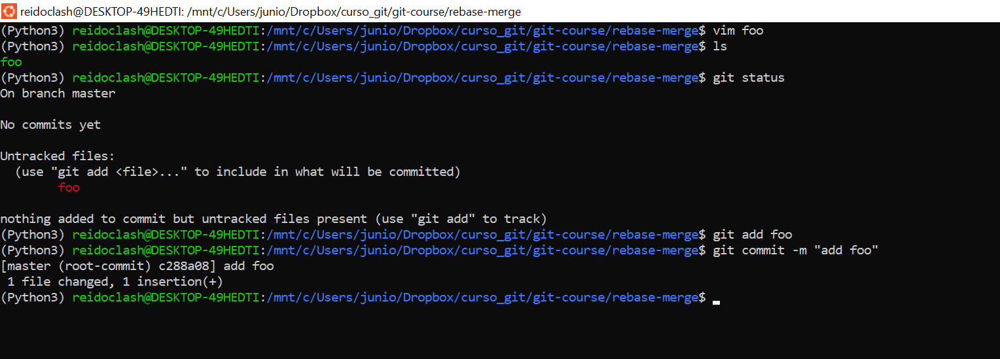
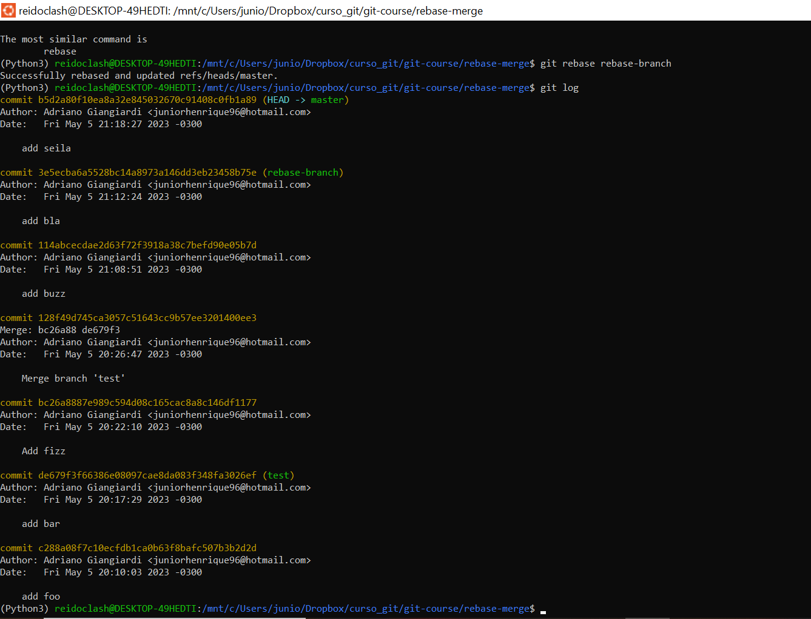

Primeiro repositório usado para testar comandos do git e github. O conteúdo pode ser encontrado no arquivo em curso_de_Git.pdf, além disso todas as anotações foram baseadas nas aulas do Willian Justen de Vasconcellos, [Git e Github para iniciantes](https://www.udemy.com/course/git-e-github-para-iniciantes/). O material encontra-se organizado em pdf, mas também pode ser visto neste Readme.

<h2> 
</h2>

<h1 align="center"> 
    

    
    Curso de Git e Github

</h1>

# Índice

* [Seção 1: Entendendo o que é o Git e Github](#Seção-1:-Entendendo-o-que-é-o-Git-e-Github)

* [Seção 2: Configurando o Git](#Seção-2:-Configurando-o-Git)

* [Seção 3: Essencial do Git](#Seção-3:-Essencial-do-Git)

    * [Inicializando um repositório](#Inicializando-um-repositório)
    * [Usando o editor do terminal](#Usando-o-editor-do-terminal)
    * [O ciclo de vida dos status de seus arquivos](#O-ciclo-de-vida-dos-status-de-seus-arquivos)
    * [Visualizando logs](#Visualizando-logs)
    * [Visualizando o diff](#Visualizando-o-diff)
    * [Desfazendo coisas](#Desfazendo-coisas)

* [Seção 4: Repositórios Remotos](#Seção-4:-Repositórios-Remotos)

    * [Criando e adicionando uma chave SSH](#Criando-e-adicionando-uma-chave-SSH)
    * [Ligando repositório local a um remoto](#Ligando-repositório-local-a-um-remoto)
    * [Enviando mudanças para um repositório remoto](#Enviando-mudanças-para-um-repositório-remoto)
    * [Clonando repositórios remotos](#Clonando-repositórios-remotos)
    * [Fazendo um fork de um projeto](#Fazendo-um-fork-de-um-projeto)

* [Seção 5: Ramificação (Branch)](#Seção-5:-Ramificação-(Branch))

    * [Criando um branch](#Criando-um-branch)
    * [Movendo e deletando branches](#Movendo-e-deletando-branches)
    * [Entendendo o merge](#Entendendo-o-merge)
    * [Entendendo o rebase](#Entendendo-o-rebase)
    * [Merge e rebase na prática](#Merge-e-rebase-na-prática)  

* [Seção 6: Extras](#Seção-6:-Extras)

    * [Criando o .gitignore](#Criando-o-.gitignore)  
    * [Git stash](#Git-stash)  
    * [Simplificação de comando](#Simplificação-de-comando)  
    * [Versionamento com tags](#Versionamento-com-tags)      
    * [Git revert](#Git-revert)      
    * [Apagando tags e branches remotos](#Apagando-tags-e-branches-remotos)   

## Seção 1: Entendendo o que é o Git e Github

Controle de versão: Sistema com a finalidade de gerenciar diferentes versões de um documento. É possível voltar para versões anteriores de um mesmo arquivo. Existem mais de um sistema além do git. 

No caso do sistema git ele não verifica as diferenças do arquivo, ele tira snapshot dos estados do arquivo em diferentes versões.
O sistema de versionamento é responsável por “versionar” os arquivos do seu projeto, os outros sistemas trabalham com a diferença dos arquivos, enquanto o git trabalha com o estado dos arquivos.

Github: É o serviço de web compartilhado para projetos que utilizam o Git para versionamento. É um local na web que vai armazenar os projetos do git. O git é o sistema de controle de versão, enquanto o Github é apenas um local remoto para armazenamento.

## Seção 2: Configurando o Git

O git guarda as informações em três lugares: git config do sistema como um todo, git config do usuário e o git config do projeto específico.
Nome de usuário: `git config --global user.name “nome”`

Email: `git config --global user.email “email”`

Definir o editor: `git config --global core.editor NomeDoEditor`

Para saber o nome de usuário basta colocar `git config --global user.name`, de modo similar com os outros comando. Caso queira saber tudo basta: `git config --list`

## Seção 3: Essencial do Git
### Inicializando um repositório

Usará o comando de criar pasta: `mkdir`
Exemplo: `mkdir git-course`

Para fazer o repositório parte do ecossistema do git precisa usar o comando `git init` dentro da pasta em questão, a partir desse comando todas mudanças serão acompanhadas. Aparecerá uma pasta .git. Pode usar o comando `ls -la` e verá também. Dentro do diretório git verá que tem algumas pastas onde: temos config (guarda a configuração do respositório), HEAD (qual branche padrão), branches (branches existentes), description, hooks (gatilhos para fazer algumas ações).

### Usando o editor do terminal
Pode usar um editor de texto separado, assim o terminal entra apenas na parte do git.

Para abrir um arquivo direto no terminal pode usar: `vi NomeDoArquivo.md` ou
usar `vim NomeDoArquivo.md`

Para inserir texto basta aperta a letra **i**, depois de escrever tudo aperta a tecla **esc** (sai do modo de inserção), **:** (indica que vai iniciar comando),  **w** (indica que é para escrever e salvar) e **q** (indica sair), no fim aperta **enter**.

### O ciclo de vida dos status de seus arquivos

Comando para reportar como está o repositório no momento: git status 

Provavelmente não vai aparecer nada para “commitar,” significa que não foi lançado para edição. Se houve alguma edição no arquivo, quando dar o comando git status vai aparecer o arquivo em *untracked*. Assim, precisa dar o comando `git add NomeDoArquivo`. Assim, o arquivo aparecerá na lista de *commited*, daí será criada uma versão. Caso tenha alguma modificação no arquivo, então precisa aplicar o comando `git add NomeDoArquivo` de novo para que as modificações sejam levadas para o *commited*. Finalmente, quando terminar tudo pode aplicar o comando `git commit -m “Add NomeDoArquivo”` para versionar/salvar as modificações, isso quer dizer que ele vai pegar todos os arquivos do repositório e criará uma imagem dele (*snapshot*). É uma boa prática colocar algum comentário das modificações feitas. Pois através dos *logs* as pessoas conseguem se localizar melhor.

Vai reparar que ele vai criar um commit segundo o nome que você dará no *branch* atual e uma *hash* criada no momento do comando, que é o número que fica ao lado do comentário feito. O *hash* é uma identificação do versionamento, nunca será repetido. Depois dá um descritivo do que foi alterado.

### Visualizando logs

Quando você deseja ver o histórico dos arquivos criados e modificados é interessante conhecer:  `git log`, ele mostra o autor e data das modificações.

`git log --decorate`, mostra informações de qual *branch* para qual *branch*.

Pode fazer filtragens de acordo com o autor: `git log --author=”nome”`

`git shortlog`, mostra para gente, em ordem alfabética, quais foram os autores, quantos *commit* fizeram e quais foram. Se quiser ver apenas a quantidade de *commit* e nome, basta: `git shortlog -sn`. 

`git log --graph`, mostra de forma gráfica o que aconteceu com o *branch* e as versões.

Com o `git show hash` (hash: é o número do commit), você consegue ver os detalhes das modificações do arquivo.

### Visualizando o diff

Serve para ver as mudanças antes de enviar para o *commit*. 

`git diff`, detalha as mudanças que houve no arquivo. É interessante fazer o *diff* antes do commit como uma forma de inspeção.

Dentro do `git diff`, temos a opção do *name only*, para dizer apenas o nome do arquivo que foi modificado. O comando: `git diff --name-only`. Ele vai listar.

Quando for comitar um arquivo que já existiu pode usar o `comando: git commit -am “comentário”`

### Desfazendo coisas

Resetar informações ou voltar no tempo. O comando `git checkout NomeDoArquivo`, ele retorna o arquivo para antes da última edição feita. Caso tenha levado essa mudança para o *stage* (lista do *commited*), pode aplicar o comando: `git reset HEAD NomeDoArquivo`. 
Caso tenha dado um *commit* errado, pode voltar pelos comandos:

* `git reset --soft HASH`, ele tira do commit e deixa no estágio de *commit*;
* `git reset --mixed HASH`, ele tira do commit e deixa no estágio *modified*;
* `git reset --hard HASH`, ele vai ignorar a existência desse *commit* e deletar tudo que foi feito do *commit*.

Obs: precisa escolher a *HASH* que quer retornar.

## Seção 4: Repositórios Remotos

É uma nuvem onde vai ficar armazenado seus códigos, arquivos, etc.

### Criando e adicionando uma chave SSH

*SSH* é um protocolo que serve para autenticar um usuário remoto ao servidor. Existe uma chave privada e uma chave pública. O link detalha mais sobre o assunto: [link](https://docs.github.com/en/authentication/connecting-to-github-with-ssh)

No link mostra como criar e adicionar uma chave. A chave fica oculta, então precisa acessa via `cd ~/.ssh/`.

Se der um comando `ls`, vai aparecer um arquivo *id_rsa.pub*. Para pegar a chave basta dar o comando `cat id_rsa.pub` ou `more id_rsa.pub` ou abrir em algum editor de texto. Para passar a chave no Github, vai em *settings*, procura *SSH and GPG Keys*, clica em *New SSH key*.

### Ligando repositório local a um remoto

Pode ir até o seu repositório e lá dá uma lista dos passos que você precisa fazer para criar/ligar um repositório. Por exemplo:

O *origin* é apenas um nome, eu poderia mudar se quiser.

O comando: `git remote`, mostra o repositório existente e o comando `git remote -v` vai mostrar os endereços.

O comando `git push -u origin master` envia os arquivos que tem, os *logs* e as modificações. O *u* serve para não precisar repetir todo o comando depois, os próximos comandos mostra da onde sai e pra onde vai. Por exemplo vai sair do *master* (a pasta atual) e ir para o *origin* (a nuvem no git).

### Enviando mudanças para um repositório remoto

Para enviar as mudanças usar o comando: `git push origin master`, onde *origin* é o nome do repositório, como foi falado, pode ser qualquer um. E o *branch* é o *master*.

### Clonando repositórios remotos

Clones de repositório é feito via comando `git clone link_repositório nome`, onde em (nome) você pode dar qualquer nome. Útil quando está em uma máquina diferente e você deseja trabalhar no mesmo repositório.

### Fazendo um fork de um projeto

*Fork* pega um projeto que não é seu e faz uma cópia para você. É bom para fazer contribuições. Você faz o *fork* dentro da plataforma Github, a diferença dele para o clone, é que o clone você faz para arquivos que é seu e pode commitar, enquanto o fork você clona e deixa para o dono do projeto ver se pode commitar.

## Seção 5: Ramificação (Branch)

*Branch* é um ponteiro móvel que leva a um *commit*. Quando criamos um *commit*, cria uma *HASH* (conjunto de números e letras), cada *HASH* indica um snapshot daquele estado. Portanto o branch aponta para esse *commit*, assim o primeiro *branch* que temos se chama master. E o branch master segue o último commit dado.

É possível criar um novo *branch* que aponte para o mesmo *commit*:

Ou pode ter outro *branch* apontando para outro *commit*:

* O uso do *branch* serve para fazer alterações sem mudar o local principal (*branch master*);
* O *branch* é facilmente “desligável”, ou seja, você pode apagar rapidamente;
* É possível que várias pessoas trabalhem em diferentes branchs, sem que um atrapalhe o outro;
* Por fim, evita conflitos, uma vez que cada um tem seu ambiente.

### Criando um branch

Para criar um *branch*, basta dar o comando:

`git checkout -b NomeDoBranch`

Para consultar quantos branchs tem, basta:

`git branch` (a saída mostra a quantidade de *branch*, onde o asterisco indica o *branch* que você está usando no momento)

### Movendo e deletando branches

Para mover de um *branch* para outro basta:

`git checkout NomeDoBranch`

Para deletar o *branch*, basta:

`git branch -D NomeDoBranch`

### Entendendo o merge

O *merge* é necessário para fazer a união do *branch* externo com o *branch master*. Exister duas formas de unir os branchs, sendo: *merge* e *rebase*.  

Ilustrando a situação inicial do arquivo:

Onde temos o *branch maste*r e um *branch* externo iss53.

Na situação acima foi criado um novo *commit* (C3) com o *branch* externo (iss53). Repare que o *master* ainda continua apontando para o C2.

Na situação acima foi criado um novo *commit* a partir do *branch master* (C4).

Agora a situação mostra um *commit*(C5) criado a partir do *branch* iss53. Enquanto o *branch master* ficou com o último *commit*.

Para fazer o *merge* é necessário criar um novo *commit* (C6), como ilustrado na situação abaixo:

Nota-se que fecha um ciclo dos *commit* do *branch* externo e do *master*. Esse ciclo é chamado também de forma diamante, pois cria certas pontas.

### Entendendo o rebase

Com base no esquema inicial do *merge* (leia o item entendendo o merge), temos:

O *rebase* ele une as mudanças de forma linear, pega tudo que estava no *branch* separado e coloca no início da fila (*fast forward*):

Ao fim do processo você tem o *branch* externo e o *branch master* apontando para o mesmo *commit*.

Conselho: Tem que tomar cuidado com conflito de arquivos uma vez que ele altera a ordem cronológica, assim ocasionando diferença de histórico para outra pessoa que esteja mexendo no mesmo arquivo.

### Merge e rebase na prática

#### MERGE

* crie uma pasta, sem seguida entre na pasta e inicie o git;
* Cria um arquivo foo com o vim;
* Use o `git add` e faça o commit;

* Crie um *branch test*;
* Crie um arquivo bar, add e faça *commit*;
* Nota-se que quando dá o `git log` tem as duas mudanças feitas, mas quando olha pela ótica do *branch master* aparece só o arquivo foo;

* Dentro do *branch master*, crie um arquivo fiz, add e faça o *commit*;
* Dê o `git log` e repare que as mudanças feitas no arquivo bar no *branch test* deve entrar entre o arquivo fiz e foo (de acordo com o histórico);

* Faça o *merge* do *branch test* com o *master*, veja as mudanças e salve;

* Dê o `git log` e veja as mudanças, repare que houve a existência de um *commit* novo para adicionar o arquivo bar (add bar);
* Pode dar o comando `git log –graph`, e repare na estrutura de ciclo, apesar do histórico linear;

#### REBASE

* Crie um arquivo buz, add e faça o *commit*;
* Dê um *log* e veja;

* Crie um novo *branch* chamado rebase-branch;
* Crie um arquivo chamado bla, add e faça o *commit*;
* Veja o *log*, depois veja com o *graph* e perceberá que ainda estará linear;
* Caso dê um `git log` pelo *branch master* o arquivo do rebase-branch não vai aparecer no histórico;

* No *branch master* crie um arquivo chamado sei la, add e faça o *commit*;
* Dê o *log*, nota-se que entre o buzz e o seila deve ter o arquivo bla do *branch* do rebase;

* Com o comando `git rebase NomeDoBranch`;
* Dê um `log ou log --graph`, nota-se que continuará linear.

Dica: Enquanto estiver adicionando novos *commit* e atualizando com outros *branch* use o *rebase*. Em caso de adição de novas informações é interessante usar o *merge*.

## Seção 6: Extras

### Criando o .gitignore

Comando usado quando tem arquivos incluído no repositório e você deseja que isso não seja compartilhado.

O uso é simples, primeiro você cria um arquivo usando algum editor e salva como *.gitignore*. O ponto serve para dizer que é um arquivo oculto no linux. Dentro desse arquivo, você vai colocar as extensões ou o arquivo em específico que você deseja que não vá no *commit*. Por exemplo:

Repare que o arquivo arquivo_qualquer.md não está aparecendo, pois dentro do *.gitignore* está especificado para ignorá-lo. Caso você queira ignorar um conjunto de extensões de arquivo, dentro do *.gitignore*, basta colocar *.extensão, por exemplo: *.py, *.xlsx, *.json, etc.

Alguns links interessantes que exploram esse comando: [lista de ignore](https://github.com/github/gitignore) e [documento](https://git-scm.com/docs/gitignore)

### Git stash

Comando usado para guardar eventuais mudanças para depois fazer um *commit*. Pode ser usado, por exemplo, em situações que você precisa entra em outro *branch*, mas não terminou suas modificações e não deseja subir as modificações para não poluir o *log*. Basta dar o comando: 

`git stash` - Ele vai guardar essa modificação, deixando em progresso (WIP).

Nesse momento é possível sair e fazer outra coisa. Quando quiser, volte e dê o comando:

`git stash apply` - Ele retorna com os arquivos que ainda faltam add e dar o *commit*.

Existe também o comando `git stash list` que mostra os *stash* que está sendo feito. Caso queira limpar isso, basta dar o comando: `git stash clear`.

### Simplificação de comando

Muitas vezes se torna exaustivo digitar todo o comando, por isso é possível simplificar algum comando, por exemplo:

* O comando `git status`, podemos pensar em apenas digitar *git s*;
* Para isso use o comando: `git config --global alias.simplifcacao comando`;
* Por exemplo: `git config --global alias.s status`.

### Versionamento com tags

Usado quando estamos trabalhando com bibliotecas ou sistemas muito grandes, estamos mexendo com o estado desses sistemas a cada *commit* dado. Então é interessante ter um marcador dessas versões, seja a cada 10 commit ou simplesmente assumir uma parte do projeto que tenha mudança suficiente para ser uma nova versão.

* Para criar uma *tag*, basta: `git tag` ; 
* Se quiser passar uma *tag* com anotação: `git tag -a versão -m “anotação”` (por exmeplo: `git tag -a 1.0.0 -m “arquivo finalizado”`);
* Quando quiser subir a tag para o github: `git push origin master --tags`, repare que lá no github terá uma release nova, inclusive com o código da versão da *tag* lançada.

### Git revert

Diferente do `git reset`, ele não apaga as modificações. É uma espécie de control z, é usado quando você não deseja apagar as modificações, pois nem tudo ali está errado. Mas ao mesmo tempo você não deseja corrigir no momento. O `git revert` é dado quando depois que você fez o *commit*, usando o comando: 

`git revert HASH` (precisa buscar a HASH do *commit* em questão)

Quando dar um `git log`, perceberá que o comando `git revert` cria um novo *commit*, e pode pegar a HASH desse novo *commit* e ver as mudanças que ocorreram usando o comando `git show HASH`. Perceberá que ele retornou para o estado anterior à mudança, mas não apagou as mudanças que foram feitas, pois o commit “estragado” ainda estará lá (*This reverts commit HASH*).

### Apagando tags e branches remotos

Para deletar *tag*, pode usar o comando:

`g tag -d NumeroDaTag` – porém isso apaga apenas localmente.

Para apagar remotamente, usa o comando:

`git push origin : NumeroDaTag`

O mesmo vale para o branch:

`git push origin :NomeDoBranch`

